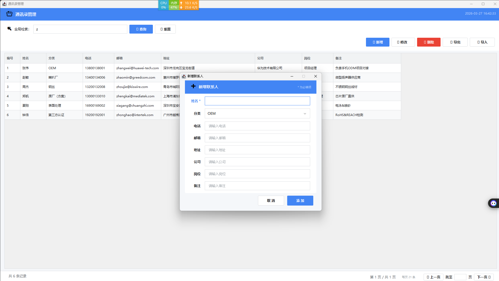

# 📒 ContactManager — 通讯录管理系统

[](https://openjdk.org/)
[](https://docs.oracle.com/javase/tutorial/uiswing/)
[](https://www.sqlite.org/)
[](LICENSE)
[](https://github.com/kekemao00/contact-manager-swing/releases)

---

## 🍺 这个项目是怎么来的

某个普通的工作日饭局，同事抱怨说市面上的通讯录工具要么太重、要么数据存云端不放心、要么分类功能完全对不上他的使用场景。

酒过三巡，我随口说了一句：

> **"这有啥难的，我给你做一个。"**

第二天早上酒醒，打开电脑，兑现承诺。

花了大约 2 小时，从零撸出了这个工具。
他用了之后说：*"比我买的那个好用多了。"*

既然做都做了，顺手开源出来——万一还有别的同事也在喝酒吹牛呢。

---

## ✨ 功能特性

| 功能 | 说明 |
|------|------|
| 📋 **联系人管理** | 新增、编辑、删除、查看，字段覆盖姓名、公司、电话、邮箱、备注等 |
| 🏷️ **行业分类筛选** | 内置 OEM、ODM、模具厂、方案商等分类，支持自定义扩展 |
| 🔍 **全局模糊搜索** | 实时过滤，输入即搜，支持姓名、公司、电话、邮箱等多字段匹配 |
| 📤 **CSV 导入导出** | 方便批量导入历史数据，随时备份导出 |
| 🔒 **自动备份** | 每次启动自动备份，保留最近 5 份，存储在用户文档目录 |
| 🎨 **现代化 UI** | 卡片式布局、扁平化按钮、交替行配色、焦点高亮、实时时钟 |
| 📦 **绿色免安装** | 内嵌 JRE，打包为单文件 `.exe`，解压即用，无需安装 Java 环境 |

---

## 📸 截图

### 登录界面


### 主界面


### 搜索与新增



---

## 🚀 快速开始

### 方式一：直接使用（推荐，无需安装 Java）

1. 前往 [Releases](https://github.com/kekemao00/contact-manager-swing/releases) 下载最新的 `contact-manager-swing.exe`
2. 双击运行，选择解压目录
3. 进入解压后的文件夹，运行 `启动通讯录.bat`
4. 使用默认账号登录：

```
账号：admin
密码：123456
```

> ⚠️ 首次登录后建议修改默认密码，毕竟 `123456` 这种密码连我同事都能猜到。

---

### 方式二：从源码编译（需要 JDK 21+）

```bash
# 克隆项目
git clone https://github.com/kekemao00/contact-manager-swing.git
cd contact-manager-swing

# 编译
javac -encoding UTF-8 -d out -cp "lib/*" src/me/kekemao/*.java

# 运行
java -cp "out;lib/*" me.kekemao.Main
```

---

## 🛠️ 技术栈

| 技术 | 版本 | 用途 |
|------|------|------|
| Java | 21 | 运行环境 |
| Java Swing | — | 桌面 GUI 框架 |
| SQLite | 3.45.2 | 本地数据存储 |
| sqlite-jdbc | 3.45.2.0 | SQLite Java 驱动 |
| SLF4J | 2.0.9 | 日志门面 |
| 7-Zip SFX | — | 打包为单文件 exe |

---

## 📁 项目结构

```
ContactManager/
├── src/me/kekemao/
│   ├── Main.java               # 程序入口
│   ├── LoginGUI.java           # 登录界面
│   ├── ContactWindow.java      # 联系人主界面（列表、搜索、分类筛选）
│   ├── ContactEditWindow.java  # 联系人编辑弹窗
│   ├── Theme.java              # 全局主题与 UI 组件工厂
│   └── Utils.java              # 数据库操作、导入导出、备份等工具类
├── lib/                        # 依赖 jar
├── jre/                        # 内嵌 JRE（打包用）
└── .gitignore
```

---

## 📄 数据存储

所有数据完全本地存储，不联网，不上云：

```
~/Documents/通讯录数据/
├── txl.db          # 主数据库
└── backup/         # 自动备份目录（保留最近 5 份）
```

每次启动时自动执行备份。你的联系人数据只属于你，不会出现在任何服务器上。

---

## 📦 依赖

```
lib/
├── sqlite-jdbc-3.45.2.0.jar
├── slf4j-api-2.0.9.jar
└── slf4j-nop-2.0.9.jar
```

---

## 🗺️ 后续计划

> 如果下次饭局再喝多了，可能会加上这些：

- [ ] 支持多用户账号管理
- [ ] 支持联系人标签（Tag）功能
- [ ] 支持导出为 vCard (.vcf) 格式
- [ ] 支持深色模式
- [ ] 支持 macOS / Linux 打包
- [ ] 支持联系人头像

欢迎提 Issue，但请不要在饭局上当面催我。

---

## 📜 License

[MIT](LICENSE) © [kekemao00](https://github.com/kekemao00)

> 开源协议选 MIT，因为我同事说他也想改改拿去用。随便，反正 2 小时做的。
