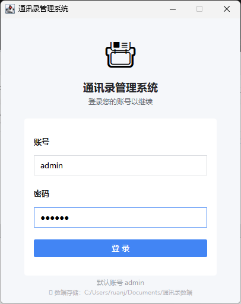
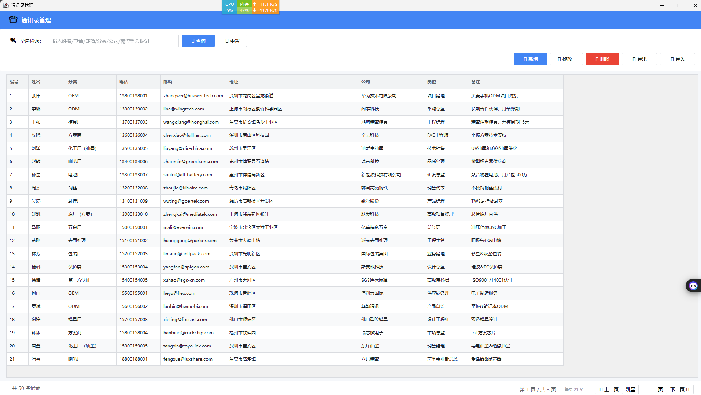

# ContactManager（通讯录管理系统）

一款基于 Java Swing 的桌面通讯录管理工具，使用 SQLite 本地存储，开箱即用。

## ✨ 功能特性

- **联系人管理** — 新增、编辑、删除、查看联系人
- **分类筛选** — 支持 OEM、ODM、模具厂、方案商等多种行业分类，支持自定义
- **全局模糊搜索** — 实时过滤，输入即搜，支持姓名、公司、电话、邮箱等多字段匹配
- **CSV 导入导出** — 方便批量导入和备份通讯录数据
- **数据安全** — 自动备份（保留最近 5 份），固定存储在用户文档目录
- **现代化 UI** — 卡片式布局、扁平化按钮、实时时钟、焦点高亮、交替行配色
- **绿色免安装** — 内嵌 JRE，无需安装 Java 环境，解压即用

## 📸 截图

### 登录界面


### 主界面


### 搜索与新增


## 🛠️ 技术栈

| 技术 | 说明 |
|------|------|
| Java 21 | 运行环境 |
| Java Swing | GUI 框架 |
| SQLite | 本地数据库 |
| 7-Zip SFX | 打包为单文件 exe |

## 📁 项目结构

```
ContactManager/
├── src/me/kekemao/
│   ├── Main.java              # 程序入口
│   ├── LoginGUI.java          # 登录界面
│   ├── ContactWindow.java     # 联系人主界面（列表、搜索、分类筛选）
│   ├── ContactEditWindow.java # 联系人编辑弹窗
│   ├── Theme.java             # 全局主题与 UI 组件工厂
│   └── Utils.java             # 数据库操作、导入导出、备份等工具类
├── lib/                       # 依赖 jar
├── jre/                       # 内嵌 JRE（打包用）
└── .gitignore
```

## 🚀 快速开始

### 从源码编译

```bash
# 需要 JDK 21+
javac -encoding UTF-8 -d out -cp "lib/*" src/me/kekemao/*.java
java -cp "out;lib/*" me.kekemao.Main
```

### 使用安装包

1. 下载最新的 `contact-manager-swing.exe`
2. 双击运行，选择安装目录
3. 进入解压后的文件夹，运行 `启动通讯录.bat`
4. 默认账号：`admin` / `123456`

## 📦 依赖

- `sqlite-jdbc-3.45.2.0.jar`
- `slf4j-api-2.0.9.jar`
- `slf4j-nop-2.0.9.jar`

## 📄 数据存储

数据库固定存储在 `~/Documents/通讯录数据/txl.db`，每次启动自动备份到 `~/Documents/通讯录数据/backup/`。

## 📜 License

[MIT License](LICENSE)
